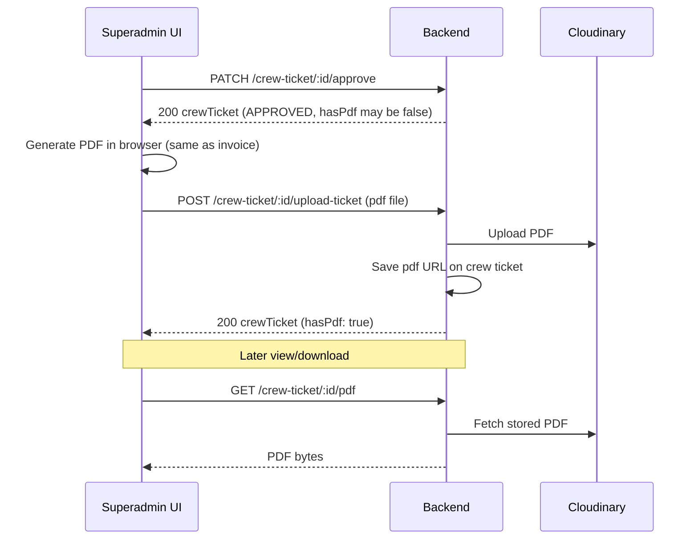

# Frontend Sync: Crew Ticket Approval & PDF Flow

This document describes how the frontend should integrate with the crew ticket approval and PDF APIs.

**Base URL:** `{API_BASE}/crew-ticket`  
(e.g. `https://marine-flight-backend.vercel.app/crew-ticket` or proxied via `env.apiBaseUrl`)

**Auth:** `Authorization: Bearer <token>` on every call below.

---

## Flow summary

1. Admin books a flight for one or more crew members.
2. Backend creates crew tickets with `status: "UNAPPROVED"`.
3. Backend emails ticket, flight, crew, and project details to the configured superadmin inbox.
4. Superadmin reviews the ticket, adds a booking reference, and approves it.
5. Backend marks the ticket `APPROVED` with the booking reference.
6. Frontend generates and uploads the PDF (recommended, Option A) or relies on backend generation (Option B).
7. Admin/crew view or download the PDF through the authenticated endpoint `GET /crew-ticket/:id/pdf`.

---

## Important: how PDFs work in this API

The backend **never returns** the raw Cloudinary URL in JSON. Responses use:

| Field | Meaning |
|--------|---------|
| `hasPdf` | `true` if a PDF is stored in Cloudinary + DB |
| `pdfDownloadUrl` | Path only: `/crew-ticket/{id}/pdf` — must be fetched with auth |

Do **not** use `window.open(ticket.pdf)` — that field is not in API responses. Use `fetch` + blob for view/download.

Frontend should treat missing `status` on old records as `UNAPPROVED` for display compatibility.

---

## Two ways to wire the frontend

### Option A — Frontend generates PDF (recommended, same as invoices)

Mirrors admin invoices: browser builds PDF → upload → backend stores URL.

```text
1. PATCH /crew-ticket/:id/approve     (superadmin, booking reference)
2. Frontend generates PDF locally
3. POST /crew-ticket/:id/upload-ticket  (multipart pdf file)
4. GET  /crew-ticket/:id/pdf           (view/download later)
```

### Option B — Backend generates PDF on approve

```text
1. PATCH /crew-ticket/:id/approve  → backend renders HTML + generates PDF + Cloudinary + DB
2. GET  /crew-ticket/:id/pdf       → stream stored PDF (or regenerate if missing)
```

**Caveat:** Option B uses server-side HTML→PDF (Puppeteer/Chromium). It is **unreliable on Vercel** unless you host a PDF service (e.g. Gotenberg). Approval can return **200 with `hasPdf: false`** if generation fails — the error is only logged server-side.

**Recommended orchestration (Option A):**

```ts
async function approveAndUploadTicketPdf(
  ticketId: string,
  bookingReference: string,
  generatePdfBlob: () => Promise<Blob>
) {
  const { crewTicket } = await approveCrewTicket(ticketId, bookingReference);

  if (!crewTicket.hasPdf) {
    const pdfBlob = await generatePdfBlob();
    const { crewTicket: withPdf } = await uploadCrewTicketPdf(ticketId, pdfBlob);
    return withPdf;
  }

  return crewTicket;
}
```



---

## Endpoints reference

### 1. Approve ticket (superadmin)

```http
PATCH /crew-ticket/:id/approve
Authorization: Bearer <superadmin_token>
Content-Type: application/json
```

**Body:**

```json
{
  "bookingReference": "8XT6HB"
}
```

**Success `200`:**

```json
{
  "message": "Crew ticket approved successfully.",
  "crewTicket": { /* see CrewTicketResponse below */ },
  "pdfDownloadUrl": "/crew-ticket/6a29cfac7563d9e715ffdb09/pdf"
}
```

**Errors:** `400` (missing reference), `401`, `403`, `404`, `409` (already approved), `500`

**Backend side-effect:** tries `generateAndUploadTicketPdf()` after approval. Check `crewTicket.hasPdf` — do not assume PDF exists.

**Frontend implementation:** `approveCrewTicket()` in `src/api/superadmin.ts`.

---

### 2. Upload PDF (frontend-generated) — invoice-style

```http
POST /crew-ticket/:id/upload-ticket
Authorization: Bearer <admin_or_superadmin_token>
Content-Type: multipart/form-data
```

**Form field:** `pdf` (single file, max 10 MB, `application/pdf`)

**Success `200`:**

```json
{
  "message": "Ticket PDF uploaded successfully.",
  "crewTicket": { /* CrewTicketResponse with hasPdf: true */ }
}
```

**Errors:** `400` (no file), `401`, `403`, `404`, `500`

**Frontend implementation:**

- Admin: `uploadCrewTicketPdf()` in `src/api/ticket.ts`
- Superadmin: `uploadSuperadminCrewTicketPdf()` in `src/api/superadmin.ts`
- Crew (own tickets): `uploadCrewTicketPdfByCrew()` in `src/api/ticket.ts`

---

### 3. Download / view PDF

```http
GET /crew-ticket/:id/pdf
Authorization: Bearer <admin_or_superadmin_or_crew_token>
```

**Success `200`:** raw PDF bytes  
**Headers:** `Content-Type: application/pdf`, `Content-Disposition: attachment; filename="crew-ticket-{bookingReference}.pdf"`

**Logic:**

1. If `ticket.pdf` exists in DB → fetch from Cloudinary
2. Else if approved + has booking reference → **regenerate** server-side, upload, save, then stream

**Errors:** `400` (no PDF and no booking reference), `403` (not approved / no access), `404`, `500`

**Frontend implementation:** `fetchCrewTicketPdfBlob()`, `openCrewTicketPdf()`, `downloadCrewTicketPdf()` in `src/api/ticket.ts`.

---

### 4. Send ticket email to crew

```http
POST /crew-ticket/:id/send-ticket-email
Authorization: Bearer <admin_or_superadmin_token>
```

**Success `200`:**

```json
{ "message": "Ticket sent successfully to crew email." }
```

Uses stored `ticket.pdf` for the email attachment link when available. Upload PDF first if you use Option A.

**Frontend implementation:** `sendSuperadminCrewTicketEmail()` in `src/api/superadmin.ts`.

---

### 5. Read ticket data (for PDF rendering on frontend)

```http
GET /crew-ticket/:id
Authorization: Bearer <admin_or_superadmin_or_crew_token>
```

**Success `200`:**

```json
{
  "crewTicket": { /* CrewTicketResponse + flightSnapshot, populated crew/project */ }
}
```

Use `flightSnapshot`, `bookingReference`, populated `crew_id` (firstname, etc.), and rig/project for your frontend ticket layout — same data the backend uses via `buildFlightTicketDataFromCrewTicket`.

**List endpoints:**

- `GET /crew-ticket` — admin/superadmin (`getCrewTickets()`, `getSuperadminCrewTickets()`)
- `GET /crew-ticket/crew/:crewId` — admin or crew (`getCrewTicketsByCrewId()`)

---

### Admin booking

```http
POST /crew-ticket/book
Authorization: Bearer <admin_token>
```

The existing request payload can stay the same. The response message now indicates tickets were sent for approval.

```ts
{
  message: string;
  crewTickets: CrewTicketResponse[];
  flightId: string;
}
```

After booking:

- Show a success state like “Ticket booked and sent for approval.”
- Render new tickets as `UNAPPROVED`.
- Disable or hide “Download ticket” until `ticket.status === "APPROVED"`.
- Keep billing display unchanged — backend still applies billing at booking time.

---

## TypeScript types (frontend)

Defined in `src/api/ticket.ts` as `CrewTicketApi`:

```ts
type CrewTicketStatus = "UNAPPROVED" | "APPROVED";

/** What the API returns — note: no `pdf` URL field */
type CrewTicketResponse = {
  id: string;
  status: CrewTicketStatus;
  bookingReference?: string;
  approvedAt?: string;
  approvedBy?: string;
  hasPdf: boolean;
  pdfDownloadUrl: string; // e.g. "/crew-ticket/abc123/pdf"
  from: { Name: string; COUNTRY: string; COUNTRYNAME: string };
  to: { Name: string; COUNTRY: string; COUNTRYNAME: string };
  class: string;
  adult: number;
  children: number;
  infants: number;
  trip: string;
  price: number;
  markup: number;
  balance: number;
  cashback: number;
  flightSnapshot?: {
    airlineName?: string;
    airlineCode?: string;
    currency?: string;
    legs: Array<{
      from?: string;
      to?: string;
      departureTime?: string;
      arrivalTime?: string;
      duration?: string;
      airlineName?: string;
      airlineCode?: string;
      itinerary?: Array<{
        airlineName?: string;
        airlineCode?: string;
        flightNumber?: string;
        from?: string;
        to?: string;
        fromAirport?: string;
        toAirport?: string;
        departureTime?: string;
        arrivalTime?: string;
        cabin?: string;
        baggage?: string;
        cabinBaggage?: string;
      }>;
    }>;
    fares?: Array<{ totalFare?: number; cabin?: string; name?: string }>;
  };
  crew_id?: { firstname?: string; lastname?: string; email?: string; /* ... */ };
  project_id?: { title?: string; /* ... */ };
  rig_id?: { name?: string; /* ... */ };
};
```

Helper functions in `src/api/ticket.ts`:

- `getTicketStatus()` / `getTicketStatusLabel()` — badge text
- `ticketHasStoredPdf()` — checks `hasPdf` (not legacy `pdf` URL)
- `canUseTicketPdf()` — whether PDF actions are enabled (approved only)
- `normalizeCrewTicket()` — normalizes API rows including snake_case variants

---

## Frontend helpers

### Approve (superadmin)

Implemented as `approveCrewTicket()` in `src/api/superadmin.ts`:

```ts
async function approveCrewTicket(ticketId: string, bookingReference: string) {
  const res = await fetch(`${apiBaseUrl}/crew-ticket/${ticketId}/approve`, {
    method: "PATCH",
    headers: {
      Authorization: `Bearer ${getAccessToken()}`,
      "Content-Type": "application/json",
    },
    body: JSON.stringify({ bookingReference: bookingReference.trim() }),
  });
  if (!res.ok) throw new Error(await res.text());
  return res.json() as Promise<{
    message: string;
    crewTicket: CrewTicketResponse;
    pdfDownloadUrl: string;
  }>;
}
```

### Upload PDF (mirror invoice upload)

```ts
async function uploadCrewTicketPdf(ticketId: string, pdfFile: File | Blob) {
  const form = new FormData();
  form.append("pdf", pdfFile, `crew-ticket-${ticketId}.pdf`);

  const res = await fetch(`${apiBaseUrl}/crew-ticket/${ticketId}/upload-ticket`, {
    method: "POST",
    headers: { Authorization: `Bearer ${getAccessToken()}` },
    body: form,
  });
  if (!res.ok) throw new Error(await res.text());
  return res.json() as Promise<{
    message: string;
    crewTicket: CrewTicketResponse;
  }>;
}
```

For invoice-style browser PDF generation, reuse the pattern in `src/lib/invoice/generateInvoicePdf.ts` (`html2pdf.js` + HTML template).

### Download / view PDF

```ts
async function fetchCrewTicketPdfBlob(ticketId: string): Promise<Blob> {
  const res = await fetch(`${apiBaseUrl}/crew-ticket/${ticketId}/pdf`, {
    headers: { Authorization: `Bearer ${getAccessToken()}` },
  });
  if (!res.ok) throw new Error("Could not load ticket PDF");
  return res.blob();
}

async function openCrewTicketPdf(ticket: CrewTicketResponse) {
  const blob = await fetchCrewTicketPdfBlob(ticket.id);
  window.open(URL.createObjectURL(blob), "_blank", "noopener,noreferrer");
}
```

---

## UI rules

```ts
const isApproved = ticket.status === "APPROVED";
const showApprove = user.role === "superadmin" && !isApproved;
const canViewPdf =
  isApproved && (ticket.hasPdf || Boolean(ticket.bookingReference));
const showPdfActions = canViewPdf;
```

- Do **not** use `window.open(ticket.pdf)` — that field is not in API responses.
- Use `fetch` + blob for view/download.
- After Option A upload, `hasPdf === true` confirms Cloudinary + DB save.
- Show a warning if approve succeeds but `hasPdf === false` and upload was not done yet.

### Superadmin approval UI

- Show approval action only for superadmin users.
- Show only when `ticket.status !== "APPROVED"`.
- Require a non-empty booking reference before submit.
- Show a loading state because approval may take a moment.
- Replace the local ticket row/detail with the returned `crewTicket`.
- After success, if `hasPdf === false`, generate and upload PDF (Option A) or prompt manual upload.

### Admin ticket list and detail

- `UNAPPROVED`: show “Pending Approval” badge.
- `APPROVED`: show “Approved” badge.
- `bookingReference`: display when present, especially on detail pages.

### Error handling (approval)

| Status | Message |
|--------|---------|
| `400` | “Enter a booking reference.” |
| `403` | “Only superadmins can approve tickets.” / “Ticket PDF is available only after approval.” |
| `409` | “This ticket has already been approved.” |
| `500` | “Could not approve the ticket. Please try again.” / “Could not load ticket PDF.” |

---

## Pages in this repo

| Page | Path | Notes |
|------|------|-------|
| Superadmin tickets | `src/pages/SuperadminTicketsPage.tsx` | Approve, manual PDF upload, send email, view PDF |
| Admin tickets | `src/pages/AdminTicketsPage.tsx` | List/detail, status badges, PDF view after approval |
| Crew tickets | `src/pages/CrewTicketsPage.tsx` | Crew self-service PDF view after approval |

---

## Frontend checklist

- [x] Types include `status`, `bookingReference`, `hasPdf`, `pdfDownloadUrl` (not `pdf`) — `src/api/ticket.ts`
- [x] Superadmin approval → `PATCH /crew-ticket/:id/approve` — `src/api/superadmin.ts`
- [x] Generate PDF in frontend on approve (reuse invoice PDF tooling) — `src/lib/crewTicket/generateCrewTicketPdf.ts`
- [x] Upload → `POST /crew-ticket/:id/upload-ticket` with field `pdf`
- [x] View/download → `GET /crew-ticket/:id/pdf` with Bearer token
- [x] Disable PDF actions until `status === "APPROVED"`
- [x] Check `hasPdf` after approve; auto-upload if false (Option A orchestration) — `src/lib/crewTicket/approveAndUploadTicketPdf.ts`
